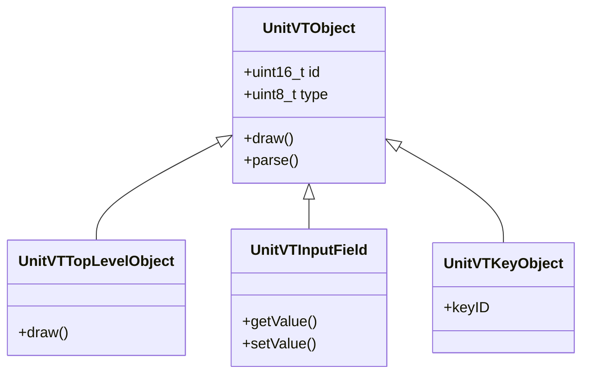

# M5IsobusVT - Entwickler- & Agenten-Dokumentation (AGENTS.md)

Dieses Dokument bietet eine technische Übersicht über das Projekt **M5IsobusVT**, seine Architektur, die Codebasis und Entwicklungsabläufe. Es soll Entwicklungs-Agents (wie Antigravity) helfen, sich schnell im Projekt zurechtzufinden und Änderungen sicher durchzuführen.

---

## 1. Projekt-Übersicht & Zweck
**M5IsobusVT** ist eine Open-Source-Implementierung eines **ISOBUS Virtual Terminals (VT)** (ISO 11783-6). Das Projekt ermöglicht es, ein VT auf extrem kleiner Hardware auszuführen oder auf einem PC zu simulieren.

Es unterstützt zwei Zielplattformen aus einer gemeinsamen C++-Codebasis:
1. **Embedded-Plattform**: Ein physisches VT auf einem **M5Stack Core2** (ESP32 mit PSRAM).
2. **Desktop-Plattform**: Ein Simulator-VT als **Qt-Widgets-Anwendung** für den PC.

> [!WARNING]
> Dieses Projekt dient ausschließlich zu Ausbildungs-, Trainings- und Laborzwecken. Es darf **nicht** auf echten Traktoren im Feld eingesetzt werden!

---

## 2. Projektstruktur & Repository-Layout

Das Repository ist als Multi-Plattform-Projekt organisiert:

- **[`/src`](file:///C:/git/fh/M5IsobusVT/src)**: Der C++-Kern des ISOBUS-VT. Diese Dateien werden sowohl vom M5Stack-Projekt (PlatformIO) als auch vom Qt-Projekt verwendet.
  - **[`UnitVTObject.h`](file:///C:/git/fh/M5IsobusVT/src/UnitVTObject.h) / [`UnitVTObject.cpp`](file:///C:/git/fh/M5IsobusVT/src/UnitVTObject.cpp)**: Basisklasse und Zeichenlogik für alle VT-Objekte.
  - **[`UnitVTObjConsts.h`](file:///C:/git/fh/M5IsobusVT/src/UnitVTObjConsts.h) / [`UnitVTObjConsts.cpp`](file:///C:/git/fh/M5IsobusVT/src/UnitVTObjConsts.cpp)**: Definitionen von VT-Konstanten, IDs und Befehlen des ISOBUS-Protokolls.
  - **[`UnitVTObjCreatePool.h`](file:///C:/git/fh/M5IsobusVT/src/UnitVTObjCreatePool.h)**: Logik zur Erstellung und Verwaltung des Object-Pools.
  - **[`m5_vt.ino`](file:///C:/git/fh/M5IsobusVT/src/m5_vt.ino)**: Der Haupt-Einstiegspunkt für das ESP32/M5Stack-Projekt (PlatformIO / Arduino-Framework).
  - Spezifische Objekt-Klassen: `UnitVTInputField*.cpp`, `UnitVTOutputField*.cpp`, `UnitVTKey*.cpp`, `UnitVTMacro*.cpp`, etc.
- **[`/M5IsobusVT`](file:///C:/git/fh/M5IsobusVT/M5IsobusVT)**: Qt-Widgets-Projekt zur Ausführung auf dem PC.
  - **[`M5IsobusVT.pro`](file:///C:/git/fh/M5IsobusVT/M5IsobusVT/M5IsobusVT.pro)**: Qt-Projektkonfiguration. Bindet die C++-Dateien aus `/src` sowie Qt-spezifische GUI-Dateien (`mainwindow.*`, `main.cpp`) ein.
- **[`/lib`](file:///C:/git/fh/M5IsobusVT/lib)**: Bibliotheken für das PlatformIO-Projekt. Enthält lokale/modifizierte Kopien von:
  - `M5Core2` (enthält spezielle Anpassungen von 'huebner')
  - `esp32-can-protocol` (CAN-Kommunikation für ESP32)
  - `MCP_CAN_lib`
  - `SdFat`, `ArduinoJson`, `JPEGDecoder`, `PNGdec`, `ESP32Time`
- **[`/SD_CARD`](file:///C:/git/fh/M5IsobusVT/SD_CARD)**: Schriftdateien (`.vlw` Fonts, z.B. Arial). Der Inhalt dieses Verzeichnisses muss auf die Root-Ebene der Micro-SD-Karte des M5Stack kopiert werden.
- **[`/docs`](file:///C:/git/fh/M5IsobusVT/docs)**: Hardware-Anschlusspläne (CAN-Adapter, D-Sub-Stecker-Belegung), Bilder des M5Stack-VT in Aktion und Screenshots der pConvert-Software.
- **[`platformio.ini`](file:///C:/git/fh/M5IsobusVT/platformio.ini)**: Konfigurationsdatei für PlatformIO (Build-Flags, Board-Definitionen, Partitionen).

---

## 3. Hardware- & Software-Konfiguration (ESP32 / M5Stack Core2)

### Hardware-Voraussetzungen:
- **M5Stack Core2** (ESP32-D0WDQ6-V3 mit 8MB PSRAM und 16MB Flash). Ältere M5Stack-Modelle ohne PSRAM sind **nicht** kompatibel!
- **Externer CAN-Transceiver**: Anbindung an den internen CAN-Controller des ESP32.
- **Micro-SD-Karte**: Mit den VLW-Fonts aus `/SD_CARD` im Hauptverzeichnis.

### Pinbelegung (CAN):
- **CAN Rx**: GPIO36
- **CAN Tx**: GPIO26
- Die D-Sub-Schnittstelle ist standardmäßig nach dem gängigen USB-CAN-Pinout belegt.

### Wichtige PlatformIO-Einstellungen ([`platformio.ini`](file:///C:/git/fh/M5IsobusVT/platformio.ini)):
- **Partitionierung**: Verwendet `default_16MB.csv` (ermöglicht ausreichend Speicherplatz für den SPIFFS-Speicher).
- **Build Flags**:
  - `-DBOARD_HAS_PSRAM`: Aktiviert PSRAM-Unterstützung.
  - `-mfix-esp32-psram-cache-issue`: Workaround für PSRAM-Cache-Probleme der ESP32-Chips.
  - `-DARDUINO_LOOP_STACK_SIZE=32768`: Erhöht die Stack-Größe des Haupt-Tasks (wichtig, da das Standard-Arduino-Stack für die komplexe ISOBUS-VT-Parsing-Logik zu klein ist).

---

## 4. Desktop-Simulator (Qt)

Das Qt-Projekt ermöglicht es, den VT-Client komfortabel auf dem Entwickler-PC zu testen und zu debuggen:
- Basiert auf **C++17** und **Qt 5 / Qt 6**.
- Verwendet das Qt-Modul `serialbus` für die CAN-Kommunikation.
- Kompilierung erfolgt über die Projektdatei `M5IsobusVT/M5IsobusVT.pro`.
- Codeänderungen an den Core-Dateien in `/src` wirken sich sofort auf beide Builds (ESP32 und Qt) aus.

---

## 5. C++ Core-Architektur (`/src`)

Die Klassenstruktur im Ordner `/src` spiegelt die ISOBUS-VT-Objekttypen wider:



- **[`UnitVTObject`](file:///C:/git/fh/M5IsobusVT/src/UnitVTObject.h)**: Die abstrakte Basisklasse. Sie deklariert virtuelle Methoden zum Zeichnen (`draw`), Aktualisieren und Parsen des Object-Pools.
- **Klassenspezifische Implementierungen**: Jedes ISOBUS-Element (z.B. Buttons, Zeiger, Formen, Zahlenfelder) erbt von `UnitVTObject` und implementiert die spezifische Darstellungslogik für das Display bzw. die Qt-Oberfläche.
- **[`UnitVTObjConsts`](file:///C:/git/fh/M5IsobusVT/src/UnitVTObjConsts.h)**: Enthält alle PGNs, Function Codes und Objekt-Typ-Konstanten laut ISO 11783-6.

---

## 6. Entwicklungsbefehle (Cheat Sheet)

### PlatformIO (M5Stack)
- **Projekt bauen**:
  ```powershell
  pio run
  ```
- **Firmware hochladen**:
  ```powershell
  pio run -t upload
  ```
- **Seriellen Monitor starten**:
  ```powershell
  pio device monitor -b 115200
  ```

### Qt Simulator (PC)
- **Projekt konfigurieren & bauen (mit qmake)**:
  ```powershell
  qmake M5IsobusVT/M5IsobusVT.pro
  nmake # oder make je nach Compiler
  ```

---

## 7. Wichtige Richtlinien für KI-Agenten

1. **Gemeinsamer Code (`/src`)**: Bei Änderungen an den C++-Dateien in `/src` muss sichergestellt sein, dass der Code sowohl mit dem ESP32-Arduino-Compiler als auch mit dem Standard-PC-C++-Compiler (GCC/MSVC via Qt) fehlerfrei kompiliert. Verwende ggf. Präprozessor-Direktiven wie `#ifdef ESP32` oder `#ifdef QT_CORE`.
2. **Bibliotheken**: Ändere niemals die M5Stack-Bibliotheken im `lib/M5Core2`-Ordner durch Standard-Versionen ab, da diese lokale Anpassungen (gekennzeichnet mit `huebner`) für das Zusammenspiel mit dem VT-Stack enthalten.
3. **Dokumentationsintegrität**: Vorhandene Kommentare, insbesondere Markierungen wie `huebner` oder Kommentare zur Stack-Größe, müssen erhalten bleiben.
